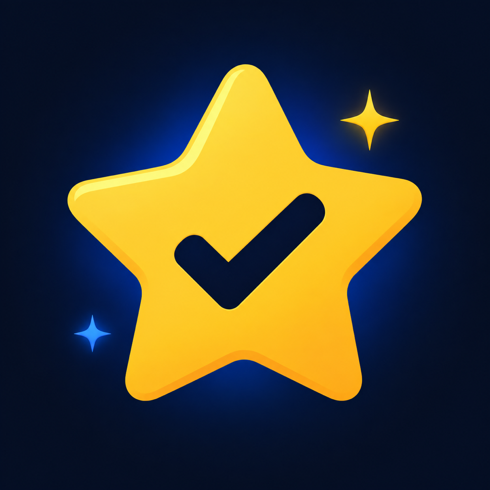
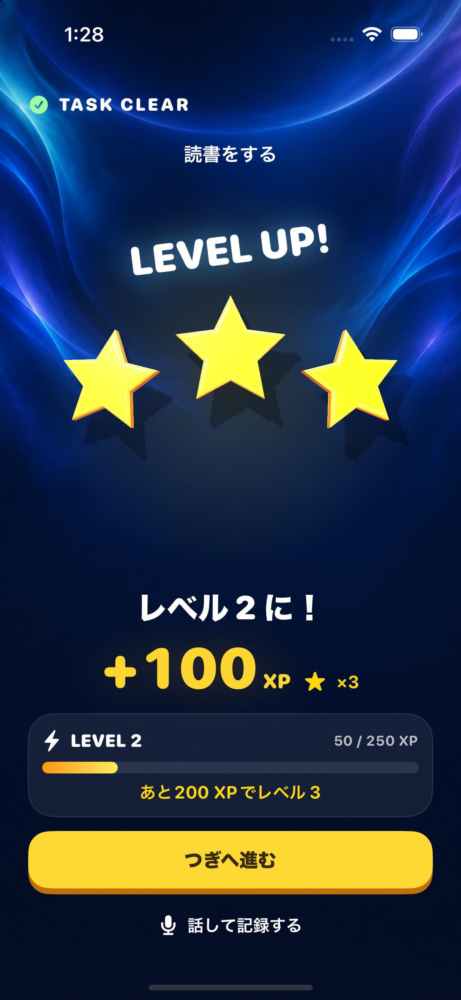
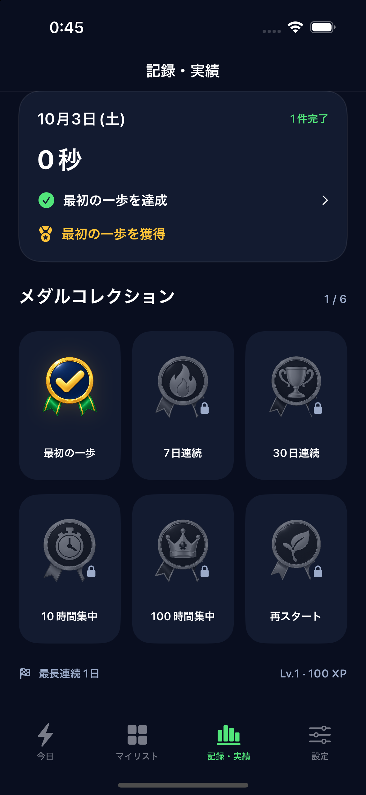

  
  <h1>ドパガキ ToDo</h1>
  
<strong>やることに集中。達成は、手に響く。</strong>

  

    
    
    
  

  

    
    
    
    
  

**Screen Timeで選んだアプリを「今日のマスト」達成まで制限し、達成した瞬間を触覚フィードバックで祝うiPhoneアプリです。**

取りかかる前は、気が散るアプリを制限してやることに集中する。取り組んでいる間は、チェックやタイマーの操作が手に返る。やりきったら、星の着地やレベルアップの振動とともに、選んだアプリが使えるようになる。この「集中するための制限」と「達成を感じる触覚」が、ドパガキの中心です。

**[セットアップ](docs/SETUP.md) · [技術構成・開発ガイド](docs/DEVELOPMENT.md) · [製品仕様](SPEC.md)**

## なぜ、ToDoにドーパミンが必要なのか

YouTubeやTikTokで、「もう一本だけ」と次の動画を開く。やることがあるのに、目の前の楽しさや刺激を欲しくなる。このプロジェクトでは、そんな感覚に心当たりがある人を、親しみを込めて**「どぱちゅう」**と呼びます。

**どぱちゅうのためのToDoには、タスクを終えた瞬間に「気持ちいい、もう一個やりたい」と思えるご褒美が必要です。** ドパガキが目指す「ドーパミンが出るToDo」とは、この達成の気持ちよさを求めて、次の行動に移りたくなる体験です。動画で味わいたくなるワクワクを、勉強や片づけなど、自分がやりたかったことを終える瞬間にもつくりたい。それが、このアプリをつくる理由です。

そのために、**Screen Timeでマスト達成まで選んだアプリを制限し、取りかかるきっかけをつくる。達成したら、触覚・音・星・紙吹雪で思いきり祝う。** 手に響く振動、増えるXP、レベルアップ、そして全マスト達成後のアプリ解放を、次の一歩につながるご褒美として届けます。

## マスト達成まで、選んだアプリを制限

「今日、必ずやること」をマストに設定し、Screen Timeで自分が選んだアプリを制限します。今日のマストをすべて完了すると制限が解除され、次の再制限時刻まで使えるようになります。

1. 今日のタスクを作り、必ず終えたいものを「マスト」にする。
2. Screen Timeの利用を許可し、集中中に制限したいアプリを選ぶ。
3. 「マスト完了までアプリを制限」をオンにして、タスクに取り組む。
4. 今日のマストをすべて完了すると、選んだアプリの制限が解除される。

マストがない日は制限しません。必要なときは15分の一時解除を利用でき、Screen Timeの許可は本人が取り消せます。翌日の再制限時刻も設定できます。

> **アプリ制限は実装済みですが、実機での動作検証は未完了です。** 無料確認版にはアプリ制限を含みません。利用に必要な環境と設定は[Screen Time対応版のセットアップ](docs/SETUP.md#screen-timeを含む通常版)を参照してください。

## 操作と達成を、触覚で感じる

触覚フィードバックは、日々の操作からタスク完了まで使い分ける**23パターン**。振動の長さ・リズム・鋭さを変え、ボタンを押した手応えや「やりきった」感覚が手に伝わるようにしています。

| 場面 | 触覚の体験 |
| --- | --- |
| 日付・時刻・目標時間を選ぶ | 値が切り替わるたびに、刻むような手応え |
| チェック・タスク保存 | 入れる／外す／全完了を異なるリズムで通知 |
| 集中タイマー | 開始・一時停止・再開・延長・目標到達をそれぞれ区別 |
| 星が着地する | 着地の瞬間に音と振動を開始し、星ごとに異なる余韻 |
| レベルアップ | 「ドン、ドン、ドーン」と約1.91秒の3連振動 |
| メダル・マスト全達成 | それぞれ専用の振動で達成を祝う |

**「設定 → 振動を試す」で全パターンを体験できます。**強さは最大・標準・弱・オフから選べます。星の着地音は「達成の音」をオンにすると有効です。

触覚は対応iPhoneで確認してください。無料確認版でも試せます。星・XP・メダル・紙吹雪は、この手応えに合わせた視覚的なお祝いです。

  
  

画像はシミュレーターの検証用データです。初回起動時にサンプルのタスクや実績は入りません。

## 集中と達成を支える機能

| 機能 | 内容 |
| --- | --- |
| タスク・習慣 | 期限、優先度、今日のマスト、チェックリスト、ラベル、毎日・曜日・毎月の繰り返し |
| 集中時間 | ストップウォッチ／タイマー、一時停止・再開・延長、時間だけの保存 |
| 達成の可視化 | 立体の星、XP、レベルアップ、紙吹雪・花火 |
| 記録・実績 | 活動カレンダー、連続記録、6種類のメダル、写真・テキスト・音声からのメモ |
| リマインダー | マストやタスクの残り件数、期限・タイマー終了を通知 |
| ウィジェット | ホーム・ロック画面、Apple Watchの文字盤・スマートスタックで「マストあと何個」を確認。Macへの表示・通知はiPhoneとの連係に対応 |

iOS 26以降では、主要な操作部分にLiquid Glassの透明感のあるデザインを取り入れています。

## ホーム画面でも、あと何個かがわかる

アプリを開く前から、今日のマストを思い出せるウィジェット。残り件数と進捗をひと目で確認し、タップすると「今日」のタスクへ戻れます。すべて終えたら、ホーム画面にも**「全達成！」**が表示されます。

  

画像はシミュレーターの検証用データです。

| 場所 | できること |
| --- | --- |
| ホーム画面 | 小サイズでマストの残り件数と進捗、中サイズでレベル・XP・全タスクの残り件数も確認 |
| ロック画面 | 円形・長方形・1行表示でマストの残り件数を確認 |
| Apple Watch | 文字盤で残り件数と達成率、スマートスタックの長方形表示でレベルも確認。タップでWatchの確認画面へ |
| Mac | iPhoneとの連係でウィジェットを表示し、「マストあと○個」の通知を受け取る |

**Apple Watchでも、手首を見るだけで今日のマストを思い出せます。** watchOS 10以降が対象です。iPhoneから件数・レベルだけを同期し、Watchの画面では次のレベルまでのXPも確認できます。タスクの完了と達成の演出はiPhoneで行います。

追加方法はアプリの**「設定 → ウィジェット・Watch・Mac」**、または[ウィジェット・Watch・Macの使い方](docs/WIDGETS.md)へ。更新時刻はOSが調整します。ホーム画面の表示・更新は確認済みです。Watch版はビルドと同期データのテストまで確認しており、Watch実機での同期・文字盤表示、ロック画面の実表示、Mac連係は追加検証が必要です。

## 最初に試す操作

1. 実機の「設定 → 振動を試す」で23パターンを試し、触覚の強さを選ぶ。
2. 「今日」からタスクを作成し、必ず終えたいものをマストにする。
3. Screen Time対応版では、利用を許可して対象アプリを選び、マスト完了までの制限を有効にする。
4. タスクに取り組み、チェックやタイマー操作の手応えを確かめる。
5. タスクを完了して、星の着地・レベルアップの振動を体験する。Screen Time対応版では、全マスト達成後の解除も確認する。
6. 音も使う場合は「達成の音」をオンにする。音は初期オフで、サイレントモードに従う。

通常の文字サイズでは完了画面のスクロールを不要にし、特大文字では全操作に届くようスクロールを許可しています。演出はスキップでき、「動きを減らす」設定にも対応しています。

触覚は実機で確認してください。最大設定でも、持ち方や端末によって感触は変わります。[演出の確認動画](Design/Verification/CompletionFireworks.mp4)はシミュレーターの映像、[着地音の試聴](Design/Verification/StarImpactPreview.mp3)は生成した効果音です。

## 保存とプライバシー

- タスク・集中時間・メモ・取り込んだ写真は端末内に保存します。ログイン・クラウド同期・独自の解析SDKはありません。
- Apple Watch対応版では、ペアリング済みのWatchへ件数・達成数・レベル・XPを共有します。タスク名・メモ・写真は送りません。
- 無料確認版から通常版へ記録は自動移行しません。
- 音声入力は端末内認識を優先します。非対応の場合はAppleの音声認識サービスを使用します。録音ファイル自体は保存しません。
- 音声・通知・Screen Timeを許可しなくても、手入力のToDoと集中記録は利用できます。
- iOSの設定により記録がバックアップに含まれる場合があります。アプリ内には全データの一括削除・書き出し機能はありません。

詳しくは [データの取り扱い](Distribution/Privacy.md) を参照してください。この文書は配布準備用の草案で、公開時には問い合わせ先などを確定する必要があります。

## セットアップ・開発資料

| 知りたいこと | ドキュメント |
| --- | --- |
| アプリを動かす・iPhoneに入れる | [セットアップ](docs/SETUP.md) |
| 使用技術・実装・テスト・コード構成 | [技術構成と開発ガイド](docs/DEVELOPMENT.md) |
| 機能の詳しい仕様 | [製品仕様](SPEC.md) |

## 配布状況と素材

ソースコードをGitHubで公開しています。TestFlight／App Storeでのアプリ配布はまだ行っていません。

アイコン・メダル・背景には画像生成素材を使用しています。素材の生成記録や配布準備の詳細は[開発ガイド](docs/DEVELOPMENT.md#素材と配布準備)にまとめています。

利用・再配布のライセンスは未設定です。コードや素材を第三者が利用・再配布する場合は、権利者への確認が必要です。
