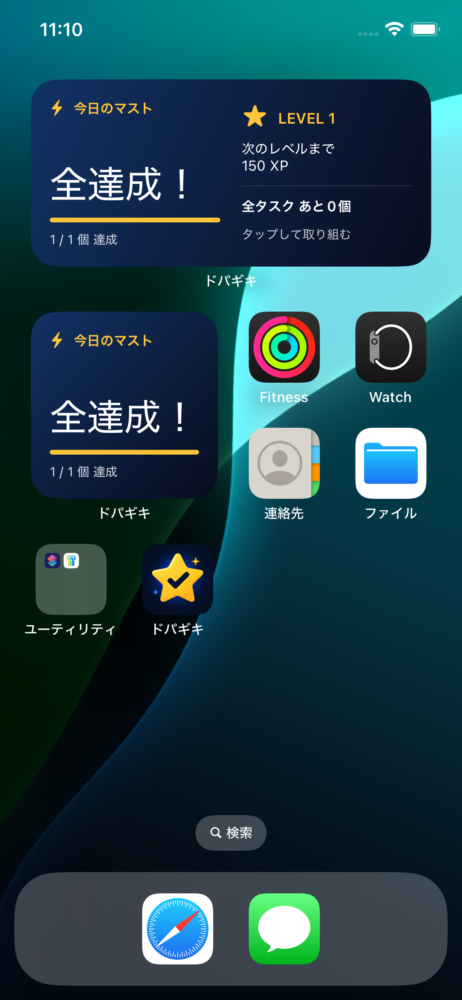

# ウィジェット・Apple Watch・Macで確認する

ドパガキを開かなくても、今日のマストがあと何個かを確認できます。ウィジェット対応版をインストールして、一度アプリを開いてから追加してください。

  

画像はシミュレーターの検証用データです。

## iPhoneのホーム画面

1. ホーム画面の空いている場所を長押しします。
2. 「編集 → ウィジェットを追加」から「ドパガキ」を探します。
3. 「今日のマスト」を選び、サイズを決めて追加します。

| サイズ | 表示する内容 |
| --- | --- |
| 小 | マストの残り件数、達成数、進捗バー |
| 中 | 小サイズの内容に加え、レベル、次のレベルまでのXP、全タスクの残り件数 |

全マストを終えると「全達成！」に変わります。マストを決めていない日は「マストなし」と表示します。タップするとアプリの「今日」を開き、いつもの操作と達成演出を使えます。

## iPhoneのロック画面

ロック画面を長押しして「カスタマイズ → ロック画面」を選び、ウィジェット欄から「ドパガキ」を追加します。

- 円形：残り件数と達成リング。
- 長方形：残り件数と進捗バー。
- 日付の上の欄：残り件数を1行で表示。

タスク名・メモ・写真はウィジェットに表示しません。件数も隠したい場合は、iPhoneのロック中のウィジェット表示設定を変更できます。

## Apple Watchの文字盤・スマートスタック

watchOS 10以降で、iPhoneとペアリングしたApple Watchに対応します。Watch対応版のドパガキをiPhoneへ入れ、iPhoneの「Watch」アプリでドパガキをインストールしてください。開発用ビルドは[Watch版のセットアップ](SETUP.md#apple-watch付きの無料確認版)を参照してください。

1. iPhoneとWatchの両方でドパガキを一度開きます。
2. **文字盤**：文字盤を長押しし、「編集」のコンプリケーション欄で「ドパガキ → 今日のマスト」を選びます。文字盤の種類によって置ける場所や形が異なります。
3. **スマートスタック**：文字盤でDigital Crownを回して開き、長押しして「＋」からドパガキを追加します。必要ならピン留めできます。

| 表示 | 内容 |
| --- | --- |
| 円形 | マストの残り件数と達成リング |
| 長方形 | 残り件数、達成率、レベル。スマートスタックでも利用 |
| インライン・文字盤の角 | 残り件数、全達成時は達成表示 |
| タップして開くWatchアプリ | 上記の集計に加えて次のレベルまでのXP、全タスクの残り件数、最終同期日時、更新ボタン |

タスクを完了する操作、Screen Timeの制限、長い触覚と達成演出はiPhone側で行います。Watchは進捗の確認用です。Watchだけでタスクを追加・完了する機能や、独自の通知・達成の振動は含みません。

同期はiPhoneからの最新集計をAppleの接続機能で届けます。圏外・省電力・バックグラウンド動作によって反映が遅れる場合があります。Watchの「iPhoneから更新」で最新の集計を要求でき、接続できない場合は最後に届いた有効な集計を表示します。タスク名・メモ・写真はWatchへ送りません。

追加操作は[Appleの文字盤ガイド](https://support.apple.com/ja-jp/guide/watch/apda6559ad78/watchos)・[スマートスタックのガイド](https://support.apple.com/ja-jp/guide/watch/apdecf142fb9/watchos)も参照してください。Watch版のSDKビルド・同期データのテストは通っていますが、実機での同期と文字盤・スマートスタックの実表示は未確認です。

## Macのデスクトップに置く

iPhoneのウィジェットをMacへ表示するAppleの連係機能を利用します。Mac専用アプリのインストールは不要です。

1. macOS Sonoma 14以降のMacと、iOS 17以降のiPhoneで同じApple Accountを使います。
2. iPhoneをMacの近くに置くか、同じWi-Fiへ接続します。
3. Macの「システム設定 → デスクトップとDock」でiPhoneウィジェットを有効にします。
4. デスクトップを右クリックして「ウィジェットを編集」を開き、「ドパガキ」を追加します。

MacではiPhone側の情報が表示されます。Mac単体でのタスク編集や独自の端末間同期は実装していません。Macからクリックした場合のアプリ起動はOSの連係機能に従います。[Appleのウィジェット案内](https://apps.apple.com/jp/mac/story/id1699687142)

## Macに「あと何個」の通知を出す

iPhoneで「設定 → やることを通知」をオンにして通知を許可します。声かけには「今日のマストはあと○個」、マストがない日は「今日のタスクはあと○個」と表示します。完了・編集後は予約を更新します。

Macで「iPhoneミラーリング」を設定して通知を許可すると、iPhoneの通知をMacでも受け取れます。「システム設定 → 通知 → iPhoneからの通知を許可」でドパガキが有効か確認してください。

通知連係にはiOS 18以降と、macOS Sequoia 15以降の対応Mac（AppleシリコンまたはT2搭載）が必要です。同じApple Accountと2ファクタ認証などの条件は[Appleの設定ガイド](https://support.apple.com/ja-jp/120421)を参照してください。通知音はアプリの音設定と各端末の通知・集中モード設定に従います。

## 更新のタイミング

アプリでタスクを保存・完了した際に、ウィジェットの更新を要求します。更新の実際の時刻はOSが調整するため、常に即時反映するとは限りません。最新状態を確かめるときはアプリを開いてください。

日付はアプリの集計タイムゾーンに合わせます。翌日分の繰り返しタスクも含めて8日分を用意し、長期間開かなかった場合は古い件数を表示し続けず「アプリを開いて更新」に切り替えます。通知は既存の7日分の予約を使います。

## ウィジェットが見つからない・更新されない

- ウィジェット対応版をインストールし、一度アプリを起動したか確認します。
- 以前の無料確認版にはウィジェットが含まれていません。[ウィジェット付き確認版のビルド](SETUP.md#ウィジェット付きの無料確認版)を参照してください。
- 「アプリを開いて更新」が続く場合は、本体とウィジェットのApp Group・署名設定を確認します。
- Watchに見つからない場合は、watchOSのバージョンとWatchへのアプリのインストールを確認します。Watchアプリに最新の同期日時が出るかも確認してください。
- Macの表示・通知の連係は実機での確認が必要です。シミュレーターだけでは検証できません。

[READMEに戻る](../README.md) · [技術構成と開発ガイド](DEVELOPMENT.md)
